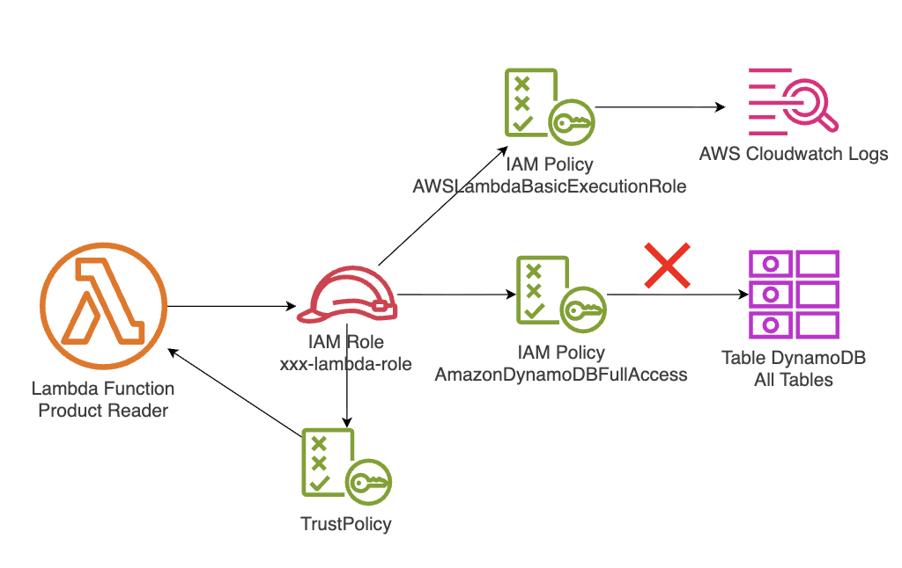
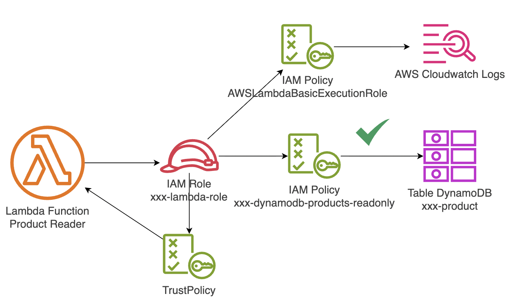

# Laboratorio AWS: Lambda con permisos excesivos sobre DynamoDB

**Instructor:** Miguel Leyva  

---

## 1. Objetivo y Alcance

### Objetivo

Comprender, mediante un caso práctico, cómo una función **AWS Lambda** con permisos excesivos sobre **Amazon DynamoDB** puede representar un riesgo de fuga de información, incumplimiento de gobierno de datos y mala práctica de seguridad.

Al finalizar el laboratorio, el estudiante será capaz de:

- Identificar permisos excesivos asociados a un rol de ejecución de Lambda.
- Evidenciar cómo una Lambda puede acceder a tablas DynamoDB que no necesita funcionalmente.
- Corregir el problema aplicando el principio de **mínimo privilegio**.
- Limitar acciones específicas sobre recursos específicos usando políticas IAM.
- Validar el comportamiento antes y después de la corrección.

### Alcance

Este laboratorio cubre:

- Creación de dos tablas DynamoDB:
  - Una tabla funcional de productos.
  - Una tabla sensible de clientes.
- Creación de una función Lambda en Node.js.
- Creación de un rol IAM con permisos excesivos inicialmente.
- Validación del riesgo al acceder a una tabla sensible.
- Corrección mediante una política IAM restrictiva.
- Pruebas funcionales y de seguridad.
- Eliminación de los recursos creados.

---

## 2. Prerequisitos y Herramientas

### Conocimientos previos recomendados

- Conceptos básicos de AWS.
- Conceptos básicos de IAM: usuarios, roles y políticas.
- Conocimiento básico de Lambda.
- Conocimiento básico de DynamoDB.
- Lectura básica de JSON.

### Herramientas necesarias

Puedes ejecutar este laboratorio desde **AWS CLI**, lo cual evita instalar herramientas en tu equipo local.

Si decides usar tu equipo local, necesitas:

- AWS CLI v2 configurado.
- Node.js 22 o superior.
- npm.
- zip.
- Permisos para crear recursos en IAM, Lambda, DynamoDB y CloudWatch Logs.

### Verificación inicial

Ejecuta los siguientes comandos:

```bash
aws --version
node --version
npm --version
zip --version
```

---

## 3. El Problema

### Narrativa del caso

La empresa **Andes Retail Insurance** está modernizando sus aplicaciones internas usando una arquitectura serverless en AWS.

Uno de sus equipos de desarrollo construyó una función Lambda llamada **Product Reader**, cuyo objetivo es consultar información de productos comerciales desde una tabla DynamoDB llamada **Products**.

Por presión de tiempo, el developer asignó al rol de ejecución de la Lambda una política administrada con permisos amplios sobre DynamoDB. La aplicación funcionó correctamente y pasó a un entorno de pruebas.

Semanas después, el equipo de seguridad descubrió que la misma Lambda podía acceder también a una tabla sensible llamada **CustomersSensitive**, que contenía datos personales de clientes.

Aunque la Lambda no tenía una necesidad funcional de acceder a esa tabla, técnicamente podía consultarla debido a que su rol tenía permisos excesivos.

El incidente no se originó por un error de código complejo, sino por una mala decisión de arquitectura de seguridad: **usar permisos amplios cuando solo se requería acceso limitado a una tabla específica**.

### Riesgo principal

La Lambda solo necesitaba leer productos, pero su rol tenía acceso amplio a DynamoDB. Si la función era comprometida, manipulada o mal utilizada, podía consultar información sensible de clientes.

### Impactos potenciales

- Fuga de datos personales.
- Incumplimiento de políticas internas de gobierno de datos.
- Incumplimiento regulatorio.
- Acceso no autorizado a información sensible.
- Falta de trazabilidad clara sobre quién debía acceder a qué dato.
- Debilidad arquitectónica por ausencia de mínimo privilegio.

### Arquitectura AS-IS



### Lectura arquitectónica del problema

En la arquitectura AS-IS, el problema es que el **rol de ejecución** de la Lambda tiene permisos superiores a los requeridos.

La función debería tener acceso únicamente a la tabla de productos. Sin embargo, al usar una política administrada amplia como `AmazonDynamoDBFullAccess`, el rol obtiene permisos sobre recursos DynamoDB que no forman parte de su responsabilidad funcional.

---

## 4. La Solución

### Enfoque de solución

La solución consiste en reemplazar los permisos amplios por una política IAM específica que cumpla con el principio de **mínimo privilegio**.

La función Lambda debe poder:

- Leer únicamente la tabla de productos.
- Ejecutar solo las acciones necesarias.
- No escribir, borrar o modificar datos.
- No acceder a la tabla sensible de clientes.

### Cambios principales

- Se elimina la política amplia `AmazonDynamoDBFullAccess` del rol de Lambda.
- Se crea una política inline restringida al rol de Lambda.
- Se permite únicamente `dynamodb:GetItem` y `dynamodb:Query` sobre la tabla de productos.
- Se valida que la Lambda sigue consultando productos correctamente.
- Se valida que la Lambda ya no puede consultar la tabla sensible.

### Arquitectura TO-BE



### Resultado esperado

La Lambda conserva su funcionalidad principal: consultar productos. Sin embargo, queda bloqueada para acceder a datos sensibles que no son parte de su responsabilidad.

Esto demuestra que el mínimo privilegio no busca impedir que las aplicaciones funcionen, sino permitir que funcionen **solo con los permisos estrictamente necesarios**.

---

## 5. Laboratorio Guiado

> Todos los comandos están orientados a ejecutarse en **AWS CLI**.

---

### Fase 1: Preparar el entorno del laboratorio

#### Paso a paso

1. Configurar Credenciales AWS

```bash
export AWS_ACCESS_KEY_ID=""
export AWS_SECRET_ACCESS_KEY=""
export AWS_SESSION_TOKEN=""
```

2. Configurar Variables para el Laboratorio

```bash
export AWS_REGION="us-east-1"
export ACCOUNT_ID=$(aws sts get-caller-identity --query Account --output text)

# Agregar las iniciales de tu nombre:
export LAB_PREFIX=""

export PRODUCTS_TABLE="${LAB_PREFIX}-products"
export CUSTOMERS_TABLE="${LAB_PREFIX}-customers-sensitive"
export ROLE_NAME="${LAB_PREFIX}-lambda-role"
export FUNCTION_NAME="${LAB_PREFIX}-product-reader"
export POLICY_NAME="${LAB_PREFIX}-dynamodb-products-readonly"
```

Validar variables:

```bash
echo $AWS_REGION
echo $ACCOUNT_ID
echo $PRODUCTS_TABLE
echo $CUSTOMERS_TABLE
echo $ROLE_NAME
echo $FUNCTION_NAME
```

3. Confirma la cuenta:

```bash
aws sts get-caller-identity
```

---

### Fase 2: Crear las tablas DynamoDB

En esta fase se crearán dos tablas:

- `<iniciales>-products`: tabla funcional que la Lambda sí debe consultar.
- `<iniciales>-customers-sensitive`: tabla sensible que la Lambda no debería consultar.

1. Crea la tabla de productos:

```bash
aws dynamodb create-table \
  --table-name "${PRODUCTS_TABLE}" \
  --attribute-definitions AttributeName=id,AttributeType=S \
  --key-schema AttributeName=id,KeyType=HASH \
  --billing-mode PAY_PER_REQUEST \
  --region "${AWS_REGION}"
```

2. Crea la tabla sensible de clientes:

```bash
aws dynamodb create-table \
  --table-name "${CUSTOMERS_TABLE}" \
  --attribute-definitions AttributeName=id,AttributeType=S \
  --key-schema AttributeName=id,KeyType=HASH \
  --billing-mode PAY_PER_REQUEST \
  --region "${AWS_REGION}"
```

3. Inserta un producto de ejemplo:

```bash
aws dynamodb put-item \
  --table-name "${PRODUCTS_TABLE}" \
  --item '{
    "id": {"S": "P001"},
    "name": {"S": "Laptop Corporativa"},
    "category": {"S": "Tecnología"},
    "price": {"N": "3500"}
  }' \
  --region "${AWS_REGION}"
```

5. Inserta un cliente sensible de ejemplo:

```bash
aws dynamodb put-item \
  --table-name "${CUSTOMERS_TABLE}" \
  --item '{
    "id": {"S": "C001"},
    "fullName": {"S": "Ana Torres"},
    "documentNumber": {"S": "DNI-12345678"},
    "email": {"S": "ana.torres@example.com"},
    "riskLevel": {"S": "Alto"}
  }' \
  --region "${AWS_REGION}"
```

6. Validar que los registros existen en Consola DynamoDB filtrado por tus iniciales
7. Elegir la tabla `<iniciales>-products` luego 'Explore table items' y validar el registro creado.
8. Luego elegir la tabla `<iniciales>-customers-sensitive` luego 'Explore table items' y validar el registro creado.


---

### Fase 3: Crear el rol IAM inseguro para Lambda

En esta fase se simula la mala práctica: asignar permisos amplios sobre DynamoDB al rol de ejecución de Lambda.

1. Ingresar al folder IAM

```bash
cd ~/MOD6-LAB1/IAM
```

2. Crea el rol IAM:

```bash
aws iam create-role \
  --role-name "${ROLE_NAME}" \
  --assume-role-policy-document file://trust-policy.json
```

3. Agrega permisos básicos para que Lambda escriba logs en CloudWatch:

```bash
aws iam attach-role-policy \
  --role-name "${ROLE_NAME}" \
  --policy-arn arn:aws:iam::aws:policy/service-role/AWSLambdaBasicExecutionRole
```

4. Agrega intencionalmente una política amplia sobre DynamoDB:

```bash
aws iam attach-role-policy \
  --role-name "${ROLE_NAME}" \
  --policy-arn arn:aws:iam::aws:policy/AmazonDynamoDBFullAccess
```

5. Obtén el ARN del rol:

```bash
export ROLE_ARN=$(aws iam get-role \
  --role-name "${ROLE_NAME}" \
  --query 'Role.Arn' \
  --output text)

echo "ARN del rol: ${ROLE_ARN}"
```

6. Lista las políticas asociadas al rol:

```bash
aws iam list-attached-role-policies \
  --role-name "${ROLE_NAME}"
```

7. Inspecciona la política administrada de DynamoDB en la Consola Web.
8. Ir a IAM > Policies > AmazonDynamoDBFullAccess encontrarás en los permisos:
    `DynamoDB -> Full access -> All resources`


#### Observación:

El rol ya tiene permisos para ejecutar la Lambda y además una política amplia sobre DynamoDB. Esta configuración es funcional, pero insegura porque no limita el acceso a una tabla específica.

---

### Fase 4: Crear el código fuente de Lambda

La función Lambda recibirá como entrada el nombre de una tabla y un identificador. Luego intentará consultar el registro en DynamoDB.

Esto permitirá demostrar que, cuando el rol tiene permisos excesivos, la Lambda puede consultar tanto la tabla de productos como la tabla sensible.

1. Ingresa al Folder Lambda:

```bash
cd ~/MOD6-LAB1/Lambda
```

2. Empaqueta la función Lambda:

```bash
zip -r function.zip index.mjs package.json package-lock.json node_modules
```

---

### Fase 5: Desplegar la función Lambda

1. Crea la función Lambda:

```bash
aws lambda create-function \
  --function-name "${FUNCTION_NAME}" \
  --runtime nodejs22.x \
  --role "${ROLE_ARN}" \
  --handler index.handler \
  --zip-file fileb://function.zip \
  --environment "Variables={PRODUCTS_TABLE=${PRODUCTS_TABLE}}" \
  --timeout 10 \
  --region "${AWS_REGION}"
```

3. Validar la función lambda desplegada en la consola web
Clic en `Lambda` > `Functions`. Luego filtrar por `<iniciales>-product-reader`.

4. Validar en `Configuration` > `Permissions` que el Role Name sea `<iniciales>-lambda-role`

---

### Fase 6: Ejecutar el escenario inseguro AS-IS

En esta fase se evidenciará que la Lambda puede consultar la tabla funcional y también la tabla sensible.

#### Prueba 1: Consultar la tabla de productos

1. Invoca la Lambda para leer la tabla de productos:

```bash
aws lambda invoke \
  --function-name "${FUNCTION_NAME}" \
  --payload "{\"tableName\":\"${PRODUCTS_TABLE}\",\"id\":\"P001\"}" \
  --cli-binary-format raw-in-base64-out \
  --region "${AWS_REGION}" \
  out-product-before.json
```

2. Visualiza la respuesta:

```bash
cat out-product-before.json
```

3. Resultado esperado:

```json
{
  "statusCode": 200,
  "body": "... Consulta realizada correctamente ..."
}
```

#### Prueba 2: Consultar la tabla sensible

1. Invoca la Lambda para intentar leer la tabla sensible:

```bash
aws lambda invoke \
  --function-name "${FUNCTION_NAME}" \
  --payload "{\"tableName\":\"${CUSTOMERS_TABLE}\",\"id\":\"C001\"}" \
  --cli-binary-format raw-in-base64-out \
  --region "${AWS_REGION}" \
  out-sensitive-before.json
```

2. Visualiza la respuesta:

```bash
cat out-sensitive-before.json
```

3. Resultado esperado en el escenario inseguro:

```json
{
  "statusCode": 200,
  "body": "... Consulta realizada correctamente ..."
}
```

---

### Fase 7: Corregir permisos aplicando mínimo privilegio

En esta fase se eliminará el permiso amplio sobre DynamoDB y se reemplazará por una política específica.

1. Regresar el directorio IAM

```bash
cd ~/MOD6-LAB1/IAM
```

2. Actualizar el json del archivo `least-privilege-policy.json` en la línea 11 con los siguientes valores:

```bash
echo "AWS_REGION = " $AWS_REGION
echo "ACCOUNT_ID = " $ACCOUNT_ID
echo "PRODUCTS_TABLE = " $PRODUCTS_TABLE
```

3. Elimina la política amplia de DynamoDB:

```bash
aws iam detach-role-policy \
  --role-name "${ROLE_NAME}" \
  --policy-arn arn:aws:iam::aws:policy/AmazonDynamoDBFullAccess
```

3. Adjunta la política de mínimo privilegio al rol:

```bash
aws iam put-role-policy \
  --role-name "${ROLE_NAME}" \
  --policy-name "${POLICY_NAME}" \
  --policy-document file://least-privilege-policy.json
```

4. Verifica las políticas del Role en IAM, ir a la consola web clic en `IAM` > `Role`:  En el filtro ingresar `<iniciales>-lambda-role`.

5. Desglosar y contrastar las políticas del Role en `Permissions`:

6. Resultado esperado: 

```bash
AWSLambdaBasicExecutionRole | AWS managed
<iniciales>-dynamodb-products-readonly | Customer inline
```
---

### Fase 8: Validar el escenario corregido TO-BE

#### Prueba 1: La Lambda debe seguir consultando productos

1. Invoca la Lambda contra la tabla de productos:

```bash
aws lambda invoke \
  --function-name "${FUNCTION_NAME}" \
  --payload "{\"tableName\":\"${PRODUCTS_TABLE}\",\"id\":\"P001\"}" \
  --cli-binary-format raw-in-base64-out \
  --region "${AWS_REGION}" \
  out-product-after.json
```

2. Visualiza la respuesta:

```bash
cat out-product-after.json
```

3. Resultado esperado:

```json
{
  "statusCode": 200,
  "body": "... Consulta realizada correctamente ..."
}
```

#### Prueba 2: La Lambda ya no debe consultar la tabla sensible

1. Invoca la Lambda contra la tabla sensible:

```bash
aws lambda invoke \
  --function-name "${FUNCTION_NAME}" \
  --payload "{\"tableName\":\"${CUSTOMERS_TABLE}\",\"id\":\"C001\"}" \
  --cli-binary-format raw-in-base64-out \
  --region "${AWS_REGION}" \
  out-sensitive-after.json
```

2. Visualiza la respuesta:

```bash
cat out-sensitive-after.json
```

3. Resultado esperado:

```json
{
  "statusCode": 500,
  "body": "... AccessDeniedException ..."
}
```

4. Interpretación:

La Lambda no falló por error de código. Falló porque IAM bloqueó correctamente el acceso a un recurso no autorizado.

Este resultado es el comportamiento esperado en una arquitectura segura.

---

## 6. Pruebas y Validación

### Validar Log en Cloudwatch

1. Ir a `Lambda` > `Functions` > `<iniciales>-product-reader`.
2. Ir a la sección `Monitor`.
3. Clic en el botón `View Logs Cloudwatch`.
4. En `Log streams`, hacer clic en el registro más reciente.
5. Buscar con Control + F la palabra Error
6. Resultado esperado:
```bash
2026-05-19T04:47:14.291Z	9cf86cb7-7ea0-4416-8860-bce36ae51038	ERROR	Error al consultar DynamoDB {
  name: 'AccessDeniedException',
  message: 'User: arn:aws:sts::654654589924:assumed-role/<iniciales>-lambda-role/<iniciales>-product-reader is not authorized to perform: dynamodb:GetItem on resource: arn:aws:dynamodb:us-east-1:654654589924:table/<iniciales>-customers-sensitive because no identity-based policy allows the dynamodb:GetItem action'
}
```

## 7. Laboratorio Propuesto

### Nuevo requerimiento

El área comercial necesita que la misma Lambda pueda consultar una nueva tabla DynamoDB llamada **Orders**, que almacenará información básica de órdenes comerciales.

El reto consiste en habilitar el acceso a esta nueva tabla **sin volver a usar permisos amplios** como `AmazonDynamoDBFullAccess`.

### Restricciones

- No modificar el código fuente de la Lambda.
- No usar políticas administradas amplias de DynamoDB.
- No dar acceso a la tabla sensible de clientes.
- Solo configurar y desplegar los recursos necesarios.
- Mantener el principio de mínimo privilegio.

### Resultado esperado

Al finalizar el reto:

- La Lambda podrá consultar `Products`.
- La Lambda podrá consultar `Orders`.
- La Lambda no podrá consultar `CustomersSensitive`.

### Pistas técnicas

#### Pista 1: Crear variable para la nueva tabla

```bash
export ORDERS_TABLE="${LAB_PREFIX}-orders"
```

#### Pista 2: Crear la tabla Orders

```bash
aws dynamodb create-table \
  --table-name "${ORDERS_TABLE}" \
  --attribute-definitions AttributeName=id,AttributeType=S \
  --key-schema AttributeName=id,KeyType=HASH \
  --billing-mode PAY_PER_REQUEST \
  --region "${AWS_REGION}"
```

#### Pista 3: Insertar un registro de orden

```bash
aws dynamodb put-item \
  --table-name "${ORDERS_TABLE}" \
  --item '{
    "id": {"S": "O001"},
    "orderNumber": {"S": "ORD-2026-001"},
    "productId": {"S": "P001"},
    "status": {"S": "CREATED"}
  }' \
  --region "${AWS_REGION}"
```

#### Pista 4: Actualizar la política inline para permitir Products y Orders

```bash
cat > least-privilege-policy-v2.json <<EOF_POLICY
{
  "Version": "2012-10-17",
  "Statement": [
    {
      "Sid": "ReadOnlyProductsAndOrdersTables",
      "Effect": "Allow",
      "Action": [
        "dynamodb:GetItem",
        "dynamodb:Query"
      ],
      "Resource": [
        "arn:aws:dynamodb:${AWS_REGION}:${ACCOUNT_ID}:table/${PRODUCTS_TABLE}",
        "arn:aws:dynamodb:${AWS_REGION}:${ACCOUNT_ID}:table/${ORDERS_TABLE}"
      ]
    }
  ]
}
EOF_POLICY

aws iam put-role-policy \
  --role-name "${ROLE_NAME}" \
  --policy-name "${POLICY_NAME}" \
  --policy-document file://least-privilege-policy-v2.json

sleep 15
```

#### Pista 5: Validar consulta a Orders

```bash
aws lambda invoke \
  --function-name "${FUNCTION_NAME}" \
  --payload "{\"tableName\":\"${ORDERS_TABLE}\",\"id\":\"O001\"}" \
  --cli-binary-format raw-in-base64-out \
  --region "${AWS_REGION}" \
  proposed-orders.json

cat proposed-orders.json
```

#### Pista 6: Validar que CustomersSensitive sigue bloqueada

```bash
aws lambda invoke \
  --function-name "${FUNCTION_NAME}" \
  --payload "{\"tableName\":\"${CUSTOMERS_TABLE}\",\"id\":\"C001\"}" \
  --cli-binary-format raw-in-base64-out \
  --region "${AWS_REGION}" \
  proposed-sensitive.json

cat proposed-sensitive.json
```

---

## 8. Limpieza de Recursos

> Ejecuta esta sección para evitar costos innecesarios y dejar la cuenta limpia.

### Paso 1: Eliminar la función Lambda

```bash
aws lambda delete-function \
  --function-name "${FUNCTION_NAME}" \
  --region "${AWS_REGION}"
```

### Paso 2: Eliminar políticas del rol IAM

1. Elimina la política inline de mínimo privilegio:

```bash
aws iam delete-role-policy \
  --role-name "${ROLE_NAME}" \
  --policy-name "${POLICY_NAME}"
```

2. Elimina la política básica de logs:

```bash
aws iam detach-role-policy \
  --role-name "${ROLE_NAME}" \
  --policy-arn arn:aws:iam::aws:policy/service-role/AWSLambdaBasicExecutionRole
```

3. Si por alguna razón la política amplia siguiera adjunta, elimínala:

```bash
aws iam detach-role-policy \
  --role-name "${ROLE_NAME}" \
  --policy-arn arn:aws:iam::aws:policy/AmazonDynamoDBFullAccess || true
```

### Paso 3: Eliminar el rol IAM

```bash
aws iam delete-role \
  --role-name "${ROLE_NAME}"
```

### Paso 4: Eliminar las tablas DynamoDB

```bash
aws dynamodb delete-table \
  --table-name "${PRODUCTS_TABLE}" \
  --region "${AWS_REGION}"

aws dynamodb delete-table \
  --table-name "${CUSTOMERS_TABLE}" \
  --region "${AWS_REGION}"
```

Si realizaste el laboratorio propuesto, elimina también la tabla `Orders`:

```bash
aws dynamodb delete-table \
  --table-name "${ORDERS_TABLE}" \
  --region "${AWS_REGION}" || true
```

### Paso 5: Eliminar logs de CloudWatch opcionalmente

```bash
aws logs delete-log-group \
  --log-group-name "/aws/lambda/${FUNCTION_NAME}" \
  --region "${AWS_REGION}" || true
```

